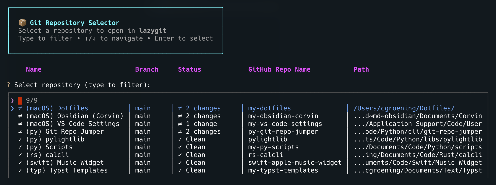

# 📦 Git Repo Jumper

A fast and elegant terminal-based Git repository selector with fuzzy finding. Quickly navigate between your repositories and open them in your favorite Git TUI tool.




## ✨ Features

- 🔍 **Fuzzy Finder** – Type to filter repositories instantly across all fields
- 📊 **Table Display** – Clean table-like interface showing name, branch, status, GitHub repo and path
- 🎨 **Beautiful UI** – Rich-styled panels and headers with color-coded information
- ⚡ **Git Status** – Real-time status showing clean repos, changes and upstream differences (↓↑)
- 🐙 **GitHub Integration** – Automatically extracts and displays GitHub repository names
- 🚨 **Error Handling** – Invalid repositories shown in a red panel before selection
- 📂 **Auto-naming** – Uses folder names if no explicit name is provided
- 🔧 **Flexible** – Works with lazygit, gitui, tig or any Git TUI tool
- 🔄 **Config Fallback** – Tries custom config first, falls back to default
- 📝 **Shell Integration** – Supports directory changing via last-repo.txt
- 🏷️ **Filtering** – Hide repositories with `show: false`
- 🔤 **Alphabetical Sorting** – Repositories sorted by name

### Planned features

- [x] Favorite/Bookmarked Repositories
- [ ] Recent Repositories History

## 🚀 Installation

### Prerequisites

- Python 3.10 or higher
- Git
- A Git TUI tool (recommended):
-
  ```zsh
  # macOS
  brew install lazygit

  # Linux (Debian/Ubuntu)
  apt install lazygit
  ```

### Install

1. Clone this repository:
   ```zsh
   git clone https://github.com/yourusername/git-repo-selector.git
   cd git-repo-selector
   ```

2. Install Python dependencies:
   ```zsh
   pip install -r requirements.txt
   ```

3. Create your `config.yaml`:

   See `src/config.yaml` for an example.

4. (Optional) Set up shell integration (see [Shell Integration](#-shell-integration))

## ⚙️ Configuration

Create a `config.yaml` file in the same directory as `main.py`:

```yaml
# Git program to use (lazygit, gitui, tig, gh, etc.)
git-program: lazygit

# Your GitHub username (optional - shortens repo names)
github-username: yourusername

# List of repositories
repos:
  # With explicit name
  - name: My Project
    path: ~/projects/my-project

  # Without name - uses folder name "dotfiles"
  - path: ~/dotfiles

  # Hide from list
  - name: Old Project
    path: ~/old-project
    show: false

  # iCloud/Obsidian vault example
  - name: Notes
    path: ~/Library/Mobile Documents/iCloud~md~obsidian/Documents/MyVault
```

### Configuration Options

| Option | Type | Required | Description | Default |
|--------|------|----------|-------------|---------|
| `git-program` | string | No | Git TUI tool to use | `lazygit` |
| `github-username` | string | No | Your GitHub username (removes from display) | `""` |
| `repos` | list | Yes | List of repository configurations | `[]` |
| `repos[].name` | string | No | Display name | folder name |
| `repos[].path` | string | Yes | Full path to repository | - |
| `repos[].show` | boolean | No | Whether to show in list | `true` |

## 📖 Usage

### Basic Usage

```zsh
# Run directly
python main.py

# Or with shell function (if configured)
rj
```

### Command Line Options

```zsh
# Use a specific git program
python main.py --program gitui

# Use a custom config file
python main.py --config ~/my-repos.yaml

# Start fresh (remove last-repo.txt)
python main.py --clean

# Combine options
python main.py --program tig --config ~/repos.yaml --clean
```

### Available Arguments

| Argument | Short | Description |
|----------|-------|-------------|
| `--program` | `-p` | Git program to use (overrides config) |
| `--config` | `-c` | Path to config file (with fallback) |
| `--clean` | - | Remove last-repo.txt before starting |
| `--help` | `-h` | Show help message |

## 🐚 Shell Integration

Add a shell function to your `~/.zshrc` or `~/.bashrc` for easy access:

```zsh
rj() {
    # Adjust path to where you placed main.py
    python3 ~/path/to/git-repo-selector/src/main.py "$@"
}
```

Then reload your shell:
```zsh
source ~/.zshrc  # or ~/.bashrc
```

Now simply run:
```zsh
rj
```

If you want to cd in to the selected repository after exiting the git program, add this to your shell function:

```zsh
rj() {
    # Run the Git Repo Jumper script
    python3 ~/path/to/git-repo-selector/src/main.py -c /Users/username/Dotfiles/git-repo-jumper/config.yaml

    # Change to cwd to the last selected repo
    local last_repo_file="/Users/cgroening/Dotfiles/git-repo-jumper/last-repo.txt"
    if [[ -f "$last_repo_file" ]]; then
        local target_dir=$(cat "$last_repo_file")
        if [[ -d "$target_dir" ]]; then
            cd "$target_dir" || return
            echo "Changed to: $(pwd)"
        else
            echo "Directory does not exist: $target_dir"
        fi
    else
        echo "Last repo file not found."
    fi
}
```

## 🎯 Features in Detail

### Fuzzy Finder

Type to filter repositories in real-time. Matches across:
- Repository names
- Branch names
- Git status
- GitHub repository names
- File paths

**Example:** Type "api" to instantly filter all repositories containing "api" in any field.

### Git Status Indicators

| Icon | Meaning |
|------|---------|
| ✓ | Clean repository (no uncommitted changes) |
| ≠ | Repository has uncommitted changes |
| ✗ | Invalid repository (not found or not a git repo) |
| ↓N | N commits behind upstream |
| ↑N | N commits ahead of upstream |

### Error Display

Invalid repositories are shown in a red error panel **before** the selection interface:

- **Path does not exist** - Repository location not found
- **Not a git repository** - Valid path but no .git directory
- **Timeout** - Git commands took too long

This allows you to quickly identify and fix configuration issues.

### GitHub Integration

The `github-username` config option shortens repository names for cleaner display:

**Without username config:**
```
yourusername/my-project  →  yourusername/my-project
yourusername/dotfiles    →  yourusername/dotfiles
```

**With username configured:**
```
yourusername/my-project  →  my-project
yourusername/dotfiles    →  Dotfiles
otherusername/repo       →  otherusername/repo  (unchanged)
```

### Config File Behavior

The tool searches for config files in this order:
1. Custom path (if `--config` is provided)
2. `config.yaml` in script directory (default)

If a custom config is not found, it automatically falls back to the default with a warning message.

### Alphabetical Sorting

All repositories are sorted alphabetically by name (case-insensitive) for easy scanning.

### Hidden Repositories

Use `show: false` to hide repositories from the list while keeping them in your config:

```yaml
repos:
  - name: Active Project
    path: ~/projects/active

  - name: Archived Project
    path: ~/projects/archived
    show: false  # Won't appear in the list
```

## 🛠️ Supported Git Programs

Built-in support for:
- **lazygit** - Full-featured TUI (recommended) - [GitHub](https://github.com/jesseduffield/lazygit)
- **gitui** - Fast TUI written in Rust - [GitHub](https://github.com/extrawurst/gitui)
- **tig** - Text-mode interface for git - [GitHub](https://github.com/jonas/tig)
- **gh** - GitHub CLI (opens in browser) - [GitHub](https://github.com/cli/cli)

Custom programs are also supported (assumes `-p <path>` flag).

## 📋 Requirements

- Python 3.10+
- InquirerPy >= 0.3.4
- PyYAML >= 6.0.0
- rich >= 13.0.0

Install all requirements:
```zsh
pip install -r requirements.txt
```
## 📝 License

This project is licensed under the MIT License - see the [LICENSE](LICENSE) file for details.

## 🙏 Acknowledgments

- [InquirerPy](https://github.com/kazhala/InquirerPy) – Beautiful interactive prompts
- [Rich](https://github.com/Textualize/rich) – Rich text and beautiful formatting in the terminal
- [lazygit](https://github.com/jesseduffield/lazygit) – Amazing Git TUI that inspired this project

## 💡 Tips

- Press `Ctrl+C` to cancel at any time
- The fuzzy finder searches across all visible columns
- Invalid repos are shown but not selectable
- Use `--clean` to reset if last-repo.txt gets corrupted
- Paths support `~` for home directory expansion

## 🐛 Troubleshooting

**Issue:** "Config file not found"
- **Solution:** Create `config.yaml` in the script directory or use `--config` flag

**Issue:** "No valid git repositories found"
- **Solution:** Check that paths in config.yaml are correct and point to git repositories

**Issue:** Git program not found
- **Solution:** Install the git tool (e.g., `brew install lazygit`) or specify a different one with `--program`

**Issue:** Repository shows as invalid
- **Solution:** Verify the path exists and contains a `.git` directory
